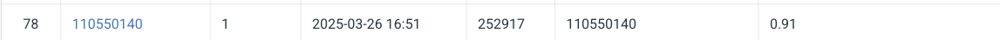

# HW1-Vision-Recognition-using-Deep-Learning-

# Introduction 
## A quicklook on model architecture
The model is based on a modified ResNet-50 backbone designed to improve feature extraction and generalization for image classification tasks. To enhance its capability, I integrated attention and multi-scale feature modules into the architecture:

- A `Convolutional Block Attention Module (CBAM)` is added to help the model focus on the most informative spatial and channel features.
- An `Inception` block is appended after the final ResNet layer to capture multi-scale visual patterns.
- A `Squeeze-and-Excitation (SE)` block further refines channel-wise representations.

The final classifier includes Layer Normalization, GELU activation, and Dropout to improve training stability and reduce overfitting. Combined with class-weighted cross-entropy loss with label smoothing, this model achieves strong performance and generalization, especially in imbalanced datasets.

## Project Structure
This project follows a modular structure to separate code, experiments, and outputs for better readability and maintainability.

- `Notebooks/`: Contains exploratory analysis (data-exploration.ipynb) and experimental notebooks for training and evaluating models (model-c5.ipynb, model-c6.ipynb). It also includes prediction outputs in CSV format.

- `src/`: Main source code directory, organized by functionality:
1. `block/`: Custom model components such as CBAM, SE, and Inception blocks.
2. `data/`: Scripts for loading and preparing datasets (make_dataset.py).
3. `features/`: Code for feature engineering or transformation logic.
4. `models/`: Training and inference scripts, including train_model.py and predict_model.py. Also includes a saved class-to-index mapping (class_to_idx.json).
5. `visualization/`: Helper functions for visualizing data, model predictions, and training metrics.

# How to install
`pip3 install torch torchvision pandas numpy pillow` 

# Performance  Snapshot
